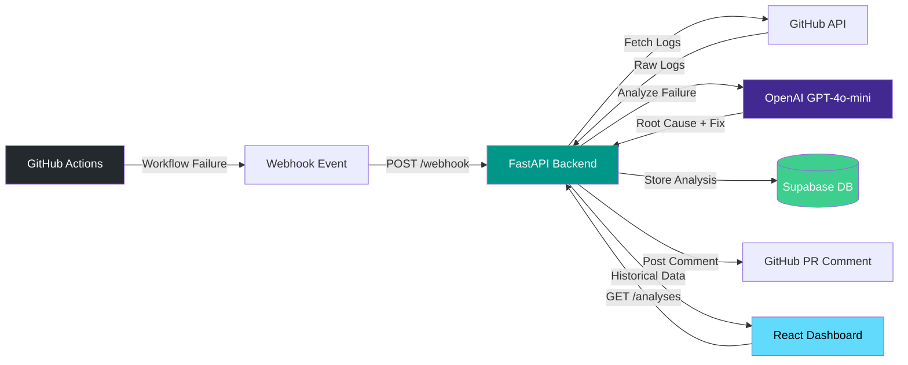

# Intelligent CI/CD Pipeline Analyzer

An AI-powered tool that integrates with GitHub Actions to automatically analyze failed CI/CD pipelines, identify root causes, and post actionable fix suggestions directly as PR comments. Browse historical analyses through an interactive React dashboard.

## Architecture



## Features

- **Automatic Failure Detection** -- Receives GitHub webhook events on workflow failures and triggers analysis immediately.
- **AI-Powered Root Cause Analysis** -- Sends pipeline logs to OpenAI for intelligent parsing, identifying the exact error, root cause, and suggested fix.
- **PR Comment Integration** -- Posts structured analysis results directly on the pull request that triggered the failed workflow.
- **Historical Analysis Dashboard** -- React-based UI to browse, search, and filter past pipeline analyses by repository, status, and date.
- **Multi-Repository Support** -- Works across any number of GitHub repositories with a single deployment.
- **Secure Secret Management** -- All API keys and tokens stored in GCP Secret Manager, never in environment variables or code.

## Tech Stack

| Layer          | Technology                          |
| -------------- | ----------------------------------- |
| Backend API    | Python 3.12, FastAPI, Uvicorn       |
| AI Engine      | OpenAI GPT-4o-mini                  |
| Frontend       | React 18, TypeScript, Tailwind CSS  |
| Database       | Supabase (PostgreSQL)               |
| Infrastructure | Terraform, Google Cloud Run         |
| CI/CD          | GitHub Actions                      |
| Containers     | Docker, Docker Compose              |
| Linting        | Ruff (Python), TypeScript strict    |

## Quick Start

### Prerequisites

- Docker and Docker Compose
- A GitHub personal access token
- An OpenAI API key
- A Supabase project (free tier works)

### Run Locally

```bash
# Clone the repository
git clone https://github.com/your-org/cicd-analyzer.git
cd cicd-analyzer

# Configure environment
cp .env.example .env
# Edit .env with your API keys and tokens

# Start all services
docker-compose up --build

# Backend API:  http://localhost:8000
# Frontend UI:  http://localhost:3000
# API docs:     http://localhost:8000/docs
```

## How It Works

1. **Webhook Reception** -- A GitHub repository is configured to send `workflow_run` events to the backend webhook endpoint (`POST /api/v1/webhook`).

2. **Log Retrieval** -- When a workflow failure event arrives, the backend uses the GitHub API to download the full workflow run logs.

3. **AI Analysis** -- The raw logs are sent to OpenAI with a structured prompt that asks for: the failing step, error message, root cause, suggested fix, and confidence level.

4. **Result Storage** -- The structured analysis is stored in Supabase with metadata (repository, workflow, commit SHA, timestamp).

5. **PR Comment** -- If the workflow was triggered by a pull request, the analysis is posted as a formatted comment on the PR with the root cause and fix suggestion.

6. **Dashboard Access** -- Users can browse all historical analyses through the React dashboard, filtering by repository, date range, or failure type.

### Setting Up the GitHub Webhook

1. Go to your repository **Settings > Webhooks > Add webhook**.
2. Set the Payload URL to `https://your-backend-url/api/v1/webhook`.
3. Set the Content type to `application/json`.
4. Enter your webhook secret (must match `GITHUB_WEBHOOK_SECRET`).
5. Select **Let me select individual events** and check **Workflow runs**.

## Deployment

### Infrastructure with Terraform

```bash
cd terraform

# Configure variables
cp terraform.tfvars.example terraform.tfvars
# Edit terraform.tfvars with your values

# Deploy
terraform init
terraform plan
terraform apply
```

This provisions:
- Required GCP APIs (Cloud Run, Secret Manager, IAM, Container Registry)
- A dedicated service account with least-privilege permissions
- Secrets in GCP Secret Manager (OpenAI key, GitHub token, Supabase credentials)
- Cloud Run services for both backend and frontend

### CI/CD with GitHub Actions

The included workflow (`.github/workflows/ci.yml`) automates the full pipeline:

| Stage              | Trigger           | Actions                                        |
| ------------------ | ----------------- | ---------------------------------------------- |
| Lint & Type Check  | All pushes and PRs | Ruff lint/format (Python), tsc type check (TS) |
| Build & Push       | Push to `main`    | Build Docker images, push to GCR               |
| Deploy             | Push to `main`    | Deploy backend and frontend to Cloud Run       |

**Required GitHub Secrets:**

| Secret            | Description                          |
| ----------------- | ------------------------------------ |
| `GCP_PROJECT_ID`  | Your Google Cloud project ID         |
| `GCP_SA_KEY`      | Service account key JSON (base64)    |

## Project Structure

```
cicd-analyzer/
├── .github/
│   └── workflows/
│       └── ci.yml                  # CI/CD pipeline definition
├── backend/
│   ├── app/
│   │   ├── api/                    # API route handlers
│   │   ├── core/                   # Configuration and settings
│   │   ├── models/                 # Pydantic schemas and data models
│   │   └── services/               # Business logic (GitHub, OpenAI, Supabase)
│   ├── Dockerfile
│   └── requirements.txt
├── frontend/
│   ├── src/
│   │   ├── components/             # React UI components
│   │   ├── hooks/                  # Custom React hooks
│   │   ├── lib/                    # API client and utilities
│   │   └── types/                  # TypeScript type definitions
│   └── Dockerfile
├── terraform/
│   ├── modules/
│   │   ├── apis/                   # GCP API enablement
│   │   ├── iam/                    # Service account and roles
│   │   ├── secret-manager/         # Secret storage
│   │   └── cloud-run/              # Cloud Run service deployment
│   ├── main.tf                     # Root module wiring
│   ├── variables.tf                # Input variables
│   ├── outputs.tf                  # Output values
│   └── terraform.tfvars.example    # Example variable values
├── docker-compose.yml              # Local development orchestration
├── .env.example                    # Environment variable template
├── .gitignore
└── README.md
```

## License

This project is licensed under the [MIT License](LICENSE).
