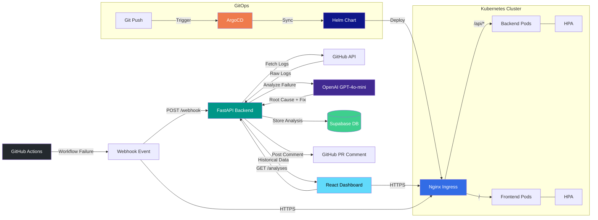

# Intelligent CI/CD Pipeline Analyzer

An AI-powered tool that integrates with GitHub Actions to automatically analyze failed CI/CD pipelines, identify root causes, and post actionable fix suggestions directly as PR comments. Browse historical analyses through an interactive React dashboard. Deploy to Kubernetes with Helm charts and manage multi-environment releases through ArgoCD GitOps.

## Architecture



## Features

- **Automatic Failure Detection** -- Receives GitHub webhook events on workflow failures and triggers analysis immediately.
- **AI-Powered Root Cause Analysis** -- Sends pipeline logs to OpenAI for intelligent parsing, identifying the exact error, root cause, and suggested fix.
- **PR Comment Integration** -- Posts structured analysis results directly on the pull request that triggered the failed workflow.
- **Historical Analysis Dashboard** -- React-based UI to browse, search, and filter past pipeline analyses by repository, status, and date.
- **Multi-Repository Support** -- Works across any number of GitHub repositories with a single deployment.
- **Secure Secret Management** -- All API keys and tokens stored in GCP Secret Manager or Kubernetes Secrets, never in environment variables or code.
- **Kubernetes-Native Deployment** -- Production-grade manifests with rolling updates, liveness/readiness/startup probes, topology spread constraints, and security contexts (non-root, read-only root filesystem, dropped capabilities).
- **Helm Chart Packaging** -- Fully parameterized Helm chart with configurable replicas, resource limits, autoscaling, ingress, network policies, and per-environment value overrides.
- **ArgoCD GitOps** -- Multi-environment ApplicationSet (dev, staging, prod) with automated sync for lower environments and manual approval for production. Includes RBAC-scoped AppProject and drift self-healing.
- **Network Security** -- Kubernetes NetworkPolicies enforce default-deny ingress/egress, allowing only the minimum required traffic paths (ingress controller to frontend, frontend/ingress to backend, backend to external HTTPS).
- **Horizontal Pod Autoscaling** -- CPU-based HPA with configurable thresholds, scale-up/down stabilization windows, and PodDisruptionBudgets for zero-downtime operations.

## Tech Stack

| Layer              | Technology                                          |
| ------------------ | --------------------------------------------------- |
| Backend API        | Python 3.12, FastAPI, Uvicorn                       |
| AI Engine          | OpenAI GPT-4o-mini                                  |
| Frontend           | React 18, TypeScript, Tailwind CSS                  |
| Database           | Supabase (PostgreSQL)                               |
| Infrastructure     | Terraform, Google Cloud Run                         |
| Orchestration      | Kubernetes, Horizontal Pod Autoscaler               |
| Package Management | Helm 3                                              |
| GitOps             | ArgoCD, ApplicationSet controller                   |
| Ingress            | Nginx Ingress Controller, cert-manager (TLS)        |
| CI/CD              | GitHub Actions                                      |
| Containers         | Docker, Docker Compose                              |
| Security           | NetworkPolicy, SecurityContext, PodDisruptionBudget |
| Linting            | Ruff (Python), TypeScript strict                    |

## Quick Start

### Prerequisites

- Docker and Docker Compose
- A GitHub personal access token
- An OpenAI API key
- A Supabase project (free tier works)

### Run Locally

```bash
# Clone the repository
git clone https://github.com/your-org/cicd-analyzer.git
cd cicd-analyzer

# Configure environment
cp .env.example .env
# Edit .env with your API keys and tokens

# Start all services
docker-compose up --build

# Backend API:  http://localhost:8000
# Frontend UI:  http://localhost:3000
# API docs:     http://localhost:8000/docs
```

## How It Works

1. **Webhook Reception** -- A GitHub repository is configured to send `workflow_run` events to the backend webhook endpoint (`POST /api/v1/webhook`).

2. **Log Retrieval** -- When a workflow failure event arrives, the backend uses the GitHub API to download the full workflow run logs.

3. **AI Analysis** -- The raw logs are sent to OpenAI with a structured prompt that asks for: the failing step, error message, root cause, suggested fix, and confidence level.

4. **Result Storage** -- The structured analysis is stored in Supabase with metadata (repository, workflow, commit SHA, timestamp).

5. **PR Comment** -- If the workflow was triggered by a pull request, the analysis is posted as a formatted comment on the PR with the root cause and fix suggestion.

6. **Dashboard Access** -- Users can browse all historical analyses through the React dashboard, filtering by repository, date range, or failure type.

### Setting Up the GitHub Webhook

1. Go to your repository **Settings > Webhooks > Add webhook**.
2. Set the Payload URL to `https://your-backend-url/api/v1/webhook`.
3. Set the Content type to `application/json`.
4. Enter your webhook secret (must match `GITHUB_WEBHOOK_SECRET`).
5. Select **Let me select individual events** and check **Workflow runs**.

## Deployment

### Infrastructure with Terraform

```bash
cd terraform

# Configure variables
cp terraform.tfvars.example terraform.tfvars
# Edit terraform.tfvars with your values

# Deploy
terraform init
terraform plan
terraform apply
```

This provisions:
- Required GCP APIs (Cloud Run, Secret Manager, IAM, Container Registry)
- A dedicated service account with least-privilege permissions
- Secrets in GCP Secret Manager (OpenAI key, GitHub token, Supabase credentials)
- Cloud Run services for both backend and frontend

### CI/CD with GitHub Actions

The included workflow (`.github/workflows/ci.yml`) automates the full pipeline:

| Stage              | Trigger           | Actions                                        |
| ------------------ | ----------------- | ---------------------------------------------- |
| Lint & Type Check  | All pushes and PRs | Ruff lint/format (Python), tsc type check (TS) |
| Build & Push       | Push to `main`    | Build Docker images, push to GCR               |
| Deploy             | Push to `main`    | Deploy backend and frontend to Cloud Run       |

**Required GitHub Secrets:**

| Secret            | Description                          |
| ----------------- | ------------------------------------ |
| `GCP_PROJECT_ID`  | Your Google Cloud project ID         |
| `GCP_SA_KEY`      | Service account key JSON (base64)    |

---

## Kubernetes Deployment

The `k8s/` directory contains production-ready plain manifests for deploying directly with `kubectl`. These manifests include security hardening (non-root containers, read-only filesystems, dropped capabilities), health probes, topology spread constraints, HPA, and NetworkPolicies.

### Prerequisites

- A running Kubernetes cluster (GKE, EKS, AKS, or local with minikube/kind)
- `kubectl` configured to target the cluster
- Nginx Ingress Controller installed
- cert-manager installed (for automatic TLS)

### Deploy with kubectl

```bash
# Create the namespace
kubectl apply -f k8s/namespace.yaml

# Create secrets (edit k8s/backend/secret.yaml with your base64-encoded values first)
kubectl apply -f k8s/backend/secret.yaml

# Deploy backend (ConfigMap, Deployment, Service, HPA)
kubectl apply -f k8s/backend/

# Deploy frontend (Deployment, Service)
kubectl apply -f k8s/frontend/

# Apply NetworkPolicies (default-deny + allow required paths)
kubectl apply -f k8s/network-policy.yaml

# Apply Ingress (update the host to your domain)
kubectl apply -f k8s/ingress.yaml

# Verify rollout
kubectl -n cicd-analyzer get pods
kubectl -n cicd-analyzer get ingress
```

### What Gets Deployed

| Resource                    | Description                                                  |
| --------------------------- | ------------------------------------------------------------ |
| Namespace                   | Dedicated `cicd-analyzer` namespace                          |
| Backend Deployment          | 2 replicas, rolling updates, startup/liveness/readiness probes |
| Frontend Deployment         | 2 replicas, rolling updates, health probes                   |
| HorizontalPodAutoscaler     | Scales backend 2-10 pods at 70% CPU utilization              |
| Ingress                     | Nginx ingress with TLS, path-based routing (`/api` and `/`)  |
| NetworkPolicy               | Default-deny ingress/egress with explicit allow rules        |
| ConfigMap + Secret          | Non-sensitive and sensitive backend configuration             |

### Security Highlights

- **Pod Security**: `runAsNonRoot: true`, `readOnlyRootFilesystem: true`, all capabilities dropped
- **Network Segmentation**: Default-deny with fine-grained allow rules per component
- **TLS Termination**: cert-manager with Let's Encrypt via Nginx Ingress
- **Security Headers**: X-Frame-Options, X-Content-Type-Options, X-XSS-Protection, Referrer-Policy

---

## Helm Chart

The `helm/cicd-analyzer/` chart packages the entire application into a single, configurable release. It supports all the same resources as the plain manifests but with full parameterization through `values.yaml`.

### Prerequisites

- Helm 3.x installed
- Nginx Ingress Controller deployed in the cluster
- cert-manager deployed (for TLS)

### Install

```bash
# Add any required dependency repos (none currently)
# helm repo add ...

# Install with default values
helm install cicd-analyzer helm/cicd-analyzer \
  --namespace cicd-analyzer \
  --create-namespace

# Install with custom values
helm install cicd-analyzer helm/cicd-analyzer \
  --namespace cicd-analyzer \
  --create-namespace \
  --set backend.image.tag=v1.2.0 \
  --set frontend.image.tag=v1.2.0 \
  --set ingress.host=myapp.example.com \
  --set backend.autoscaling.maxReplicas=20

# Install with a values file override
helm install cicd-analyzer helm/cicd-analyzer \
  --namespace cicd-analyzer \
  --create-namespace \
  -f my-custom-values.yaml
```

### Upgrade

```bash
helm upgrade cicd-analyzer helm/cicd-analyzer \
  --namespace cicd-analyzer \
  --set backend.image.tag=v1.3.0 \
  --set frontend.image.tag=v1.3.0
```

### Uninstall

```bash
helm uninstall cicd-analyzer --namespace cicd-analyzer
```

### Key Configuration Parameters

| Parameter                                  | Default                            | Description                         |
| ------------------------------------------ | ---------------------------------- | ----------------------------------- |
| `backend.replicaCount`                     | `2`                                | Backend pod replicas                |
| `backend.image.repository`                 | `cicd-analyzer/backend`            | Backend image repository            |
| `backend.image.tag`                        | `latest`                           | Backend image tag                   |
| `backend.autoscaling.enabled`              | `true`                             | Enable HPA for backend              |
| `backend.autoscaling.minReplicas`          | `2`                                | HPA minimum replicas                |
| `backend.autoscaling.maxReplicas`          | `10`                               | HPA maximum replicas                |
| `backend.autoscaling.targetCPUUtilizationPercentage` | `70`                   | CPU threshold for scaling           |
| `backend.config.OPENAI_MODEL`             | `gpt-4o`                           | OpenAI model to use                 |
| `backend.existingSecret`                   | `""`                               | Use existing secret (skip creation) |
| `frontend.replicaCount`                    | `2`                                | Frontend pod replicas               |
| `frontend.image.repository`                | `cicd-analyzer/frontend`           | Frontend image repository           |
| `ingress.enabled`                          | `true`                             | Enable Nginx Ingress                |
| `ingress.host`                             | `cicd-analyzer.example.com`        | Ingress hostname                    |
| `ingress.tls.enabled`                      | `true`                             | Enable TLS via cert-manager         |
| `networkPolicy.enabled`                    | `true`                             | Deploy NetworkPolicy resources      |
| `podDisruptionBudget.enabled`              | `true`                             | Deploy PDB                          |
| `podDisruptionBudget.minAvailable`         | `1`                                | Minimum available pods during disruption |
| `serviceAccount.create`                    | `true`                             | Create a dedicated ServiceAccount   |

See [`helm/cicd-analyzer/values.yaml`](helm/cicd-analyzer/values.yaml) for the full list of configurable parameters.

---

## ArgoCD GitOps

The `argocd/` directory provides a complete GitOps setup for managing multi-environment deployments through ArgoCD. It includes an AppProject with RBAC, a standalone Application, and an ApplicationSet that generates per-environment Applications from a single template.

### Prerequisites

- ArgoCD installed in the cluster (namespace `argocd`)
- The Git repository registered as a source in ArgoCD
- ApplicationSet controller enabled (bundled with ArgoCD 2.3+)

### Architecture

The ApplicationSet uses a **list generator** to create three Applications from a single template:

| Environment | Git Branch | Namespace              | Auto-Sync | Prune   | Use Case                          |
| ----------- | ---------- | ---------------------- | --------- | ------- | --------------------------------- |
| **dev**     | `develop`  | `cicd-analyzer-dev`    | Yes       | Yes     | Rapid iteration, debug logging    |
| **staging** | `staging`  | `cicd-analyzer-staging`| Yes       | Yes     | Pre-production validation         |
| **prod**    | `main`     | `cicd-analyzer-prod`   | No        | No      | Manual sync, production workloads |

Each environment uses the base `helm/cicd-analyzer/values.yaml` merged with an environment-specific overlay from `argocd/overlays/<env>/values.yaml`. Key differences per environment:

- **Dev**: Single replica, autoscaling disabled, `gpt-4o-mini` model, debug logging, Let's Encrypt staging issuer, no NetworkPolicy
- **Staging**: 2 replicas, HPA 2-5 pods, info logging, Let's Encrypt staging issuer, NetworkPolicy enabled
- **Prod**: 3 replicas, HPA 3-10 pods, 4 workers, warning-only logging, rate limiting on ingress, `existingSecret` for credentials, PDB minAvailable=2

### Deploy

```bash
# 1. Create the AppProject (defines allowed repos, namespaces, and RBAC)
kubectl apply -f argocd/project.yaml

# 2. Deploy the ApplicationSet (creates dev, staging, and prod Applications)
kubectl apply -f argocd/applicationset.yaml

# Or deploy a single standalone Application instead
kubectl apply -f argocd/application.yaml
```

### Verify

```bash
# List all ArgoCD applications for this project
argocd app list --project cicd-analyzer

# Check sync status of a specific environment
argocd app get cicd-analyzer-dev
argocd app get cicd-analyzer-staging
argocd app get cicd-analyzer-prod

# Manually sync production (auto-sync is disabled for prod)
argocd app sync cicd-analyzer-prod
```

### GitOps Workflow

1. **Development**: Push to `develop` branch. ArgoCD auto-syncs to `cicd-analyzer-dev` namespace within seconds.
2. **Staging**: Merge to `staging` branch. ArgoCD auto-syncs to `cicd-analyzer-staging` namespace. Run integration tests.
3. **Production**: Merge to `main` branch. ArgoCD detects drift but does **not** auto-sync. A team member reviews the diff in the ArgoCD UI and manually triggers sync.

### AppProject RBAC

The ArgoCD AppProject defines two roles:

| Role       | Group                    | Permissions                       |
| ---------- | ------------------------ | --------------------------------- |
| `admin`    | `cicd-analyzer-admins`   | Full access (sync, delete, override) |
| `readonly` | `cicd-analyzer-viewers`  | Read-only (view status and logs)  |

---

## Project Structure

```
cicd-analyzer/
├── .github/
│   └── workflows/
│       └── ci.yml                          # CI/CD pipeline definition
├── backend/
│   ├── app/
│   │   ├── api/                            # API route handlers
│   │   ├── core/                           # Configuration and settings
│   │   ├── models/                         # Pydantic schemas and data models
│   │   └── services/                       # Business logic (GitHub, OpenAI, Supabase)
│   ├── Dockerfile
│   └── requirements.txt
├── frontend/
│   ├── src/
│   │   ├── components/                     # React UI components
│   │   ├── hooks/                          # Custom React hooks
│   │   ├── lib/                            # API client and utilities
│   │   └── types/                          # TypeScript type definitions
│   └── Dockerfile
├── terraform/
│   ├── modules/
│   │   ├── apis/                           # GCP API enablement
│   │   ├── iam/                            # Service account and roles
│   │   ├── secret-manager/                 # Secret storage
│   │   └── cloud-run/                      # Cloud Run service deployment
│   ├── main.tf                             # Root module wiring
│   ├── variables.tf                        # Input variables
│   ├── outputs.tf                          # Output values
│   └── terraform.tfvars.example            # Example variable values
├── k8s/                                    # Plain Kubernetes manifests
│   ├── namespace.yaml                      # Dedicated namespace
│   ├── ingress.yaml                        # Nginx Ingress with TLS and security headers
│   ├── network-policy.yaml                 # Default-deny + fine-grained allow rules
│   ├── backend/
│   │   ├── configmap.yaml                  # Non-sensitive backend configuration
│   │   ├── secret.yaml                     # Sensitive credentials (base64)
│   │   ├── deployment.yaml                 # Backend pods with probes and security context
│   │   ├── service.yaml                    # ClusterIP service on port 8000
│   │   └── hpa.yaml                        # Horizontal Pod Autoscaler (2-10 replicas)
│   └── frontend/
│       ├── deployment.yaml                 # Frontend pods with probes
│       └── service.yaml                    # ClusterIP service on port 80
├── helm/
│   └── cicd-analyzer/                      # Helm chart
│       ├── Chart.yaml                      # Chart metadata (v0.1.0, appVersion 1.0.0)
│       ├── values.yaml                     # Default configuration values
│       └── templates/
│           ├── _helpers.tpl                # Template helper functions
│           ├── NOTES.txt                   # Post-install usage notes
│           ├── serviceaccount.yaml         # Optional ServiceAccount
│           ├── backend-configmap.yaml      # Templated backend ConfigMap
│           ├── backend-secret.yaml         # Templated backend Secret
│           ├── backend-deployment.yaml     # Templated backend Deployment
│           ├── backend-service.yaml        # Templated backend Service
│           ├── backend-hpa.yaml            # Templated backend HPA
│           ├── frontend-deployment.yaml    # Templated frontend Deployment
│           ├── frontend-service.yaml       # Templated frontend Service
│           ├── ingress.yaml                # Templated Ingress
│           └── network-policy.yaml         # Templated NetworkPolicy
├── argocd/                                 # ArgoCD GitOps configuration
│   ├── project.yaml                        # AppProject with RBAC and allowed resources
│   ├── application.yaml                    # Standalone Application (single-env)
│   ├── applicationset.yaml                 # Multi-env ApplicationSet (dev/staging/prod)
│   └── overlays/                           # Per-environment Helm value overrides
│       ├── dev/
│       │   └── values.yaml                 # Dev: 1 replica, debug, no HPA, no NetworkPolicy
│       ├── staging/
│       │   └── values.yaml                 # Staging: 2 replicas, HPA 2-5, info logging
│       └── prod/
│           └── values.yaml                 # Prod: 3 replicas, HPA 3-10, rate limiting, PDB
├── docker-compose.yml                      # Local development orchestration
├── .env.example                            # Environment variable template
├── .gitignore
└── README.md
```

## License

This project is licensed under the [MIT License](LICENSE).
